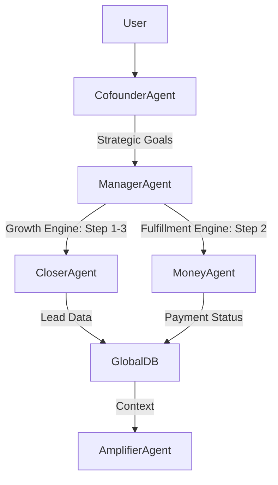

## types of AI agents and their features


The video discusses five types of AI agents and their features:

- **Closer Agent** [[01:03](http://www.youtube.com/watch?v=sIugzOQz7Vk&t=63)]
  - Lead Intelligence: Automates research, scraping, qualifying, and data enrichment for leads [[01:32](http://www.youtube.com/watch?v=sIugzOQz7Vk&t=92)].
  - Closing Support: Conducts research on prospects, pulls previous chats and conversations, and transcribes/summarizes discussions to provide context for salespersons [[01:42](http://www.youtube.com/watch?v=sIugzOQz7Vk&t=102)].
  - Qualifying Bot: Uses voice AI to qualify inquiries or calls, asking questions about customer needs, urgency, and budget [[01:58](http://www.youtube.com/watch?v=sIugzOQz7Vk&t=118)].
- **Assistant Agent** [[02:46](http://www.youtube.com/watch?v=sIugzOQz7Vk&t=166)]
  - Email Sorting: Summarizes and responds to messages, opportunities, and project updates, and can automate tasks like tagging financial emails or processing accounts payable [0003:24].
  - Calendar Management: Supports research, scheduling, and note-taking related to the calendar, helping to prioritize revenue-generating activities [[03:53](http://www.youtube.com/watch?v=sIugzOQz7Vk&t=233)].
  - Bookings: Automates research and scheduling for travel, flights, hotels, and dinners [[04:17](http://www.youtube.com/watch?v=sIugzOQz7Vk&t=257)].
- **Workflow Agent** [[04:52](http://www.youtube.com/watch?v=sIugzOQz7Vk&t=292)]
  - System Creator Bot: Captures videos of work processes to generate standard operating procedures (SOPs) and checklists [[05:24](http://www.youtube.com/watch?v=sIugzOQz7Vk&t=324)].
  - Office Manager Bot: Manages tasks like purchasing, scheduling (e.g., barber appointments), and provides information on company policies like vacation or expense submission [[05:43](http://www.youtube.com/watch?v=sIugzOQz7Vk&t=343)].
  - Customer Support Bot: Handles support calls and emails, leveraging existing information to provide responses, identify upsell opportunities, and enhance customer experience [[06:09](http://www.youtube.com/watch?v=sIugzOQz7Vk&t=369)].
- **Amplifier Agent** [[06:37](http://www.youtube.com/watch?v=sIugzOQz7Vk&t=397)]
  - Content Analysis: Analyzes content performance to identify what works and what doesn't, providing insights for improvement [[07:30](http://www.youtube.com/watch?v=sIugzOQz7Vk&t=450)].
  - Content Checker: Ensures new content aligns with the brand's voice and tone by analyzing existing content [[07:54](http://www.youtube.com/watch?v=sIugzOQz7Vk&t=474)].
  - Content Creation: Supports the creation of various content formats (videos, reels, newsletters, tweets) by generating outlines, assisting with editing, and extracting insights based on audience resonance [[08:17](http://www.youtube.com/watch?v=sIugzOQz7Vk&t=497)].
- **Money Agent** [[08:52](http://www.youtube.com/watch?v=sIugzOQz7Vk&t=532)]
  - Cash Flow Bot: Monitors and forecasts cash flow, tracks money collection, and analyzes historical trends to aid in real-time decision-making [[09:34](http://www.youtube.com/watch?v=sIugzOQz7Vk&t=574)].
  - Payment Bot: Automates accounts payable by scanning documents (like PDFs from email or Slack), checking details, and initiating approval workflows [[09:51](http://www.youtube.com/watch?v=sIugzOQz7Vk&t=591)].
  - Fraud Bot: Monitors bank accounts for anomalies and suspicious activities, such as unauthorized payments or credit card misuse, and brings them to attention [[10:22](http://www.youtube.com/watch?v=sIugzOQz7Vk&t=622)].


### value engines


creating "value engines" as visual systems to help businesses scale without constant owner intervention, challenging the idea of documenting every process.

Here are the key points:

**Core Principles of Documenting Systems:**

- **Document Only the Critical:** Avoid documenting every task; focus on critical processes [[01:00](http://www.youtube.com/watch?v=-mTmvZjNPdU&t=60)].
- **Understand Value Drivers vs. Value Chains:**
  - **Value Drivers:** Individual advantages contributing to initial success (e.g., marketing, sales) [[03:04](http://www.youtube.com/watch?v=-mTmvZjNPdU&t=184)].
  - **Value Chains:** Collections of value drivers that produce overall business value, crucial for scaling [[03:48](http://www.youtube.com/watch?v=-mTmvZjNPdU&t=228)].
- **Visualize to Optimize:** Visually represent how your company creates and captures value for optimization [[04:19](http://www.youtube.com/watch?v=-mTmvZjNPdU&t=259)].

**What is a Value Engine?**

- A visual representation of how a company creates and captures marketplace value, covering customer acquisition, fulfillment, and product improvement [[05:00](http://www.youtube.com/watch?v=-mTmvZjNPdU&t=300)].
- **Three Types of Value Engines:**
  - **Growth Engine:** Visualizes attracting and converting new customers [[06:06](http://www.youtube.com/watch?v=-mTmvZjNPdU&t=366)].
  - **Fulfillment Engine:** Documents delivering promised value to customers post-sale [[06:30](http://www.youtube.com/watch?v=-mTmvZjNPdU&t=390)].
  - **Innovation Engine:** Visualizes creating or improving offerings (not detailed in this video) [[06:47](http://www.youtube.com/watch?v=-mTmvZjNPdU&t=407)].

**How to Map Your First Value Engine (Step-by-Step):**

1. **Identify the Engine:** Name the engine you are mapping (e.g., "Growth Engine: Mommy Fit") [[07:45](http://www.youtube.com/watch?v=-mTmvZjNPdU&t=465)].
2. **Define Triggering and Ending Events:**
   - **Triggering Event:** What starts the process (e.g., how people become aware) [[08:13](http://www.youtube.com/watch?v=-mTmvZjNPdU&t=493)].
   - **Ending Event:** When the process is complete (e.g., sale made) [[08:45](http://www.youtube.com/watch?v=-mTmvZjNPdU&t=525)].
3. **Brainstorm Tasks and Activities:**
   - Use sticky notes and a whiteboard [[05:56](http://www.youtube.com/watch?v=-mTmvZjNPdU&t=356)].
   - **Squares:** Simple tasks/activities [[10:13](http://www.youtube.com/watch?v=-mTmvZjNPdU&t=613)].
   - **Diamonds:** Decision points or "gateways" [[10:25](http://www.youtube.com/watch?v=-mTmvZjNPdU&t=625)].
   - Continuously ask "then what?" to map the flow [[10:30](http://www.youtube.com/watch?v=-mTmvZjNPdU&t=630)].
   - Document "what is" currently happening, not "what should be" [[14:25](http://www.youtube.com/watch?v=-mTmvZjNPdU&t=865)].
4. **Hold a Stakeholder Review Meeting:** Get team input to identify missed steps [[15:04](http://www.youtube.com/watch?v=-mTmvZjNPdU&t=904)].
5. **Conduct a Value Engine Audit:**
   - Identify "power stages" – critical steps that cannot fail [[16:15](http://www.youtube.com/watch?v=-mTmvZjNPdU&t=975)].
   - Assign ownership for documenting these critical stages with checklists or SOPs [[17:27](http://www.youtube.com/watch?v=-mTmvZjNPdU&t=1047)].
6. **Finalize into a Flowchart Tool:** Transfer the map to a professional flowchart tool [[18:10](http://www.youtube.com/watch?v=-mTmvZjNPdU&t=1090)].
7. **Add to Company's Operating System:** Integrate the finalized value engine for team access [[18:20](http://www.youtube.com/watch?v=-mTmvZjNPdU&t=1100)].

This approach aims to pass down knowledge and create systems without burnout or excessive documentation [[18:51](http://www.youtube.com/watch?v=-mTmvZjNPdU&t=1131)].


Here’s a comprehensive architecture for an **AI Agent Virtual Office** where multiple specialized agents (with individual memory/tools) collaborate under a hierarchical structure, leveraging global context sharing and task delegation. The design is inspired by the "value engine" framework and the five AI agent types (Closer, Assistant, Workflow, Amplifier, Money).

---

### **AI Virtual Office Architecture**
#### **1. Hierarchy & Agent Roles**
| **Agent Tier**       | **Role**                                                                 | **Example Agents**                                                                 |
|-----------------------|--------------------------------------------------------------------------|-----------------------------------------------------------------------------------|
| **Cofounder Agent**   | Strategic decision-maker; interfaces with real users/clients.            | - User Proxy Agent (discusses goals with humans)                                  |
| **Manager Agent**     | Oversees execution, assigns tasks, ensures alignment with value engines. | - Task Orchestrator <br> - Value Engine Auditor (audits Growth/Fulfillment/Innovation) |
| **Specialist Agents** | Perform domain-specific tasks with tools/memory.                         | - Closer Agent (sales) <br> - Assistant Agent (ops) <br> - Amplifier Agent (content) <br> - Money Agent (finance) |

---

#### **2. Core Components**
##### **A. Global Context Layer**
- **Shared Memory Database**: Stores real-time context (e.g., client requests, task status, value engine maps).  
  - *Tools*: Vector DB (e.g., Pinecone) for semantic search + Graph DB (e.g., Neo4j) for process flows.  
- **Event Bus**: Facilitates pub/sub messaging for inter-agent coordination (e.g., "Task X completed → trigger Payment Bot").  

##### **B. Agent Design (Per Specialist)**
```python
class Agent:
    def __init__(self):
        self.memory = EmbeddingMemory()  # Local memory (recalls past tasks)
        self.tools = [Tool1, Tool2]      # Domain-specific tools (e.g., email API, scraper)
        self.role = "Closer"             # Defined by Manager Agent
    
    def execute(task, global_context):
        # Pulls global context (e.g., "Client A needs budget analysis")
        # Updates local memory + shares results via Event Bus
```

##### **C. Task Workflow Engine**
- **Manager Agent** decomposes goals (from Cofounder) into tasks using **value chain logic**:  
  - *Example*: "Acquire 10 leads" → [Lead Intelligence Bot → Qualifying Bot → Closing Support].  
- **Power Stage Triggers**: Critical steps (e.g., contract signed) auto-trigger next agents (e.g., Payment Bot).  

---

#### **3. Example Workflow: Client Onboarding**
1. **Cofounder Agent** discusses needs with a user → Goal: "Scale content marketing."  
2. **Manager Agent** maps this to the **Growth Value Engine**:  
   - Triggers: Amplifier Agent (analyze past content) → Assistant Agent (schedule posts).  
3. **Specialist Agents Collaborate**:  
   - *Amplifier*: Uses "Content Checker" tool → shares brand guidelines globally.  
   - *Assistant*: Books creator interviews (Calendar Bot + Workflow Agent for SOPs).  
4. **Global DB Updates**: All actions logged → visible to Fraud Bot (monitors spending).  

---

#### **4. Tools & Integration**
| **Component**       | **Implementation**                                                                 |
|----------------------|------------------------------------------------------------------------------------|
| **Agent Memory**     | Local: Langchain + Vector DB <br> Global: Redis (caching) + PostgreSQL (transactions) |
| **Event Bus**        | Apache Kafka/RabbitMQ for task updates                                             |
| **Value Engine Maps**| Miro/Lucidchart API (auto-updated by Manager Agent)                                |
| **Auth & Governance**| OAuth for human-in-the-loop approvals (e.g., Money Agent payments)                 |

---

#### **5. Key Features**
- **Dynamic Prioritization**: Manager Agent reroutes tasks if a power stage fails (e.g., Fraud Bot flags payment → pauses workflow).  
- **Audit Trails**: Every action links to a value engine node (e.g., "Content posted → Growth Engine Step 3.2").  
- **Human Oversight**: Cofounder/Manager Agents request input via Slack/MS Teams if confidence < threshold.  

---

### **Visualization**


This architecture ensures agents operate within documented **value engines** while retaining autonomy for local decisions. The system scales by adding/updating agents per value chain needs (e.g., adding a **Legal Agent** for contract reviews).