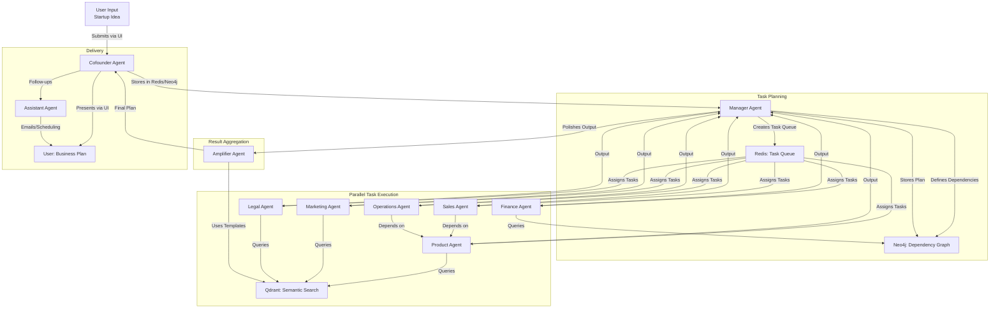
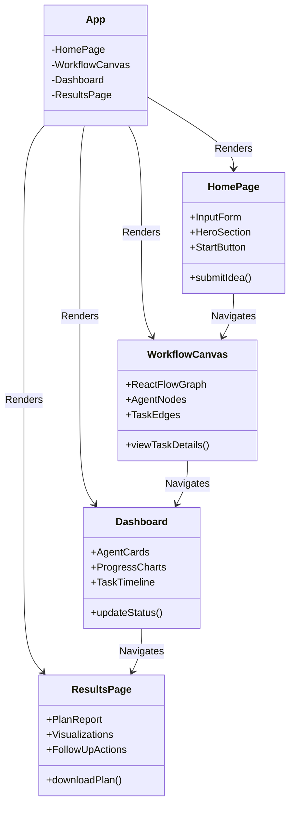

To address your request for a detailed vision of the **AgentFlow** workflow and UI, I'll describe the refined workflow and user interface for your AI Virtual Office Platform, keeping it aligned with the original concept of specialized AI agents collaborating to solve business problems. The workflow will be visualized using **Mermaid** to illustrate the agent interactions and task flow, and I'll describe the UI components with a focus on their layout and functionality, also using Mermaid for a high-level UI structure diagram. The solution will use free services, maintain the core logic of the original system, and address your pain points (workflow clarity and UI modernization) to ensure a portfolio-ready project.

---

## 🌟 Workflow Description

The **AgentFlow** workflow is designed to transform a user's startup idea into a comprehensive business plan through collaborative AI agents. The workflow is orchestrated by the **Manager Agent**, with the **Cofounder Agent** as the user interface, and other specialized agents working in parallel to produce components of the business plan. The process leverages **Neo4j** for dependency management, **Qdrant** for semantic data retrieval, and **Redis** for real-time state tracking. The workflow is structured to be clear, scalable, and visually representable in the UI for portfolio appeal.

### Workflow Steps
1. **User Input**:
   - The user submits a startup idea (e.g., "sustainable fashion brand") via the UI.
   - The **Cofounder Agent** processes the input, stores it in Redis (session state) and Neo4j (business entity graph).

2. **Task Planning**:
   - The **Manager Agent** analyzes the idea, identifies required tasks (e.g., market analysis, financial modeling), and creates a task queue in Redis.
   - Dependencies between tasks are stored in Neo4j (e.g., Marketing depends on Product’s user personas).

3. **Parallel Task Execution**:
   - Specialized agents (Product, Finance, Marketing, Legal, Sales, Operations) execute tasks concurrently:
     - **Product Agent**: Defines MVP and personas, querying Qdrant for market data.
     - **Finance Agent**: Generates financial projections, using Neo4j for context.
     - **Marketing Agent**: Develops campaign strategies, leveraging Qdrant for trends.
     - **Legal Agent**: Identifies compliance requirements, searching Qdrant for regulations.
     - **Sales/Operations Agents**: Build strategies based on other agents’ outputs.
   - The **Manager Agent** monitors progress via Redis, resolving conflicts (e.g., resource contention).

4. **Result Aggregation**:
   - The **Manager Agent** collects outputs, stored in Neo4j as a business plan graph.
   - The **Amplifier Agent** generates a polished report, using Qdrant for templates.

5. **User Delivery**:
   - The **Cofounder Agent** presents the business plan via the UI, with visualizations (e.g., charts) from Neo4j data.
   - The **Assistant Agent** handles follow-ups (e.g., emails, scheduling).

### Workflow Visualization (Mermaid)
Below is a **Mermaid flowchart** representing the AgentFlow workflow, showing how agents interact and tasks flow from user input to final output.

**Explanation**:
- **Nodes**: Represent agents, user, or systems (Redis, Neo4j, Qdrant).
- **Edges**: Show data flow (e.g., user input to Cofounder Agent, task assignments to specialized agents).
- **Subgraphs**: Group stages (Input, Task Planning, Execution, Aggregation, Delivery) for clarity.
- **Parallel Execution**: Specialized agents (F, G, H, I, J, K) work concurrently, with dependencies managed by Neo4j.

### Workflow Improvements
- **Clarity**: The Manager Agent centralizes task orchestration, using Redis for fast queuing and Neo4j for dependency tracking, addressing your workflow "stuck" point.
- **Parallelism**: Concurrent task execution reduces latency, with Redis ensuring real-time updates.
- **Visualization**: The workflow is designed to be displayed in the UI (via React Flow), making it intuitive for portfolio demos.
- **Error Handling**: The Manager Agent retries failed tasks or reassigns them, stored in Redis for tracking.

---

## 🌐 UI Description

The UI is designed to be modern, responsive, and portfolio-ready, showcasing the AgentFlow workflow and agent interactions. It uses **React**, **Tailwind CSS**, and **React Flow** (all free) to create an intuitive, interactive experience. The UI emphasizes:
- **Simplicity**: Clean design for ease of use.
- **Interactivity**: Real-time task monitoring and workflow visualization.
- **Portfolio Appeal**: Professional styling and dynamic features to impress viewers.

### UI Components
1. **Home Page**:
   - **Purpose**: Welcome users and collect startup ideas.
   - **Features**: Input form, hero section with project overview, and a "Start Planning" button.
   - **Design**: Minimalist layout with Tailwind CSS, featuring a centered form and branded colors.

2. **Workflow Canvas**:
   - **Purpose**: Visualize and interact with the agent workflow.
   - **Features**: Drag-and-drop interface (React Flow) showing agents as nodes and tasks as edges. Users can click nodes to view task details.
   - **Design**: Full-screen canvas with zoomable graph, styled nodes (agent cards), and animated edges.

3. **Dashboard**:
   - **Purpose**: Monitor agent activities and business plan progress.
   - **Features**: Real-time task status cards, charts (e.g., financial projections), and a timeline of completed tasks.
   - **Design**: Grid layout with Tailwind CSS, featuring agent cards and embedded charts (using Chart.js, free).

4. **Results Page**:
   - **Purpose**: Display the final business plan and allow follow-up actions.
   - **Features**: Downloadable PDF report, interactive visualizations (e.g., market analysis graphs), and follow-up task triggers (e.g., email scheduling).
   - **Design**: Clean layout with sections for each agent’s output, styled with Tailwind CSS.

### UI Structure (Mermaid)
Below is a **Mermaid class diagram** representing the UI component hierarchy and their relationships.

**Explanation**:
- **Classes**: Represent UI components (App, HomePage, WorkflowCanvas, Dashboard, ResultsPage).
- **Attributes**: Key elements or subcomponents (e.g., InputForm, AgentNodes).
- **Methods**: Core functionalities (e.g., submitIdea, downloadPlan).
- **Relationships**: Arrows show navigation flow (e.g., HomePage to WorkflowCanvas) and component rendering.

### UI Tech Stack
- **React**: Dynamic, component-based UI.
- **Tailwind CSS**: Utility-first styling for responsiveness.
- **React Flow**: Interactive workflow visualization (free).
- **Chart.js**: Free library for charts in the Dashboard.
- **Axios**: API calls to the FastAPI backend.

### UI Design Principles
- **Responsive**: Adapts to desktop and mobile using Tailwind’s responsive utilities.
- **Interactive**: Real-time updates (via WebSockets or polling) for task statuses and workflow changes.
- **Professional**: Clean typography, consistent colors (e.g., blue/white theme), and subtle animations for portfolio appeal.

---

## 💡 Addressing Pain Points

### Workflow
- **Problem**: Unclear how agents collaborate and tasks flow.
- **Solution**: The Mermaid flowchart clarifies the process, with the Manager Agent orchestrating tasks, Redis handling queuing, and Neo4j managing dependencies. Parallel execution and visualization ensure clarity and efficiency.

### UI
- **Problem**: Original UI lacks modern appeal for a portfolio.
- **Solution**: The refactored UI uses Tailwind CSS for styling, React Flow for interactive workflows, and Chart.js for visualizations. The component hierarchy (Mermaid class diagram) ensures modularity and ease of maintenance.

---

## 🚀 Implementation Notes

To implement this workflow and UI:
1. **Workflow**:
   - Use **FastAPI** to handle task queuing (Redis) and dependency management (Neo4j).
   - Integrate **Qdrant** for semantic search using `sentence-transformers/all-MiniLM-L6-v2` (free via Hugging Face).
   - Implement the Manager Agent to monitor Redis and resolve task conflicts.

2. **UI**:
   - Set up **React** with `create-react-app` and install `tailwindcss`, `react-flow-renderer`, and `chart.js`.
   - Create components as described (HomePage, WorkflowCanvas, etc.) and style with Tailwind.
   - Use Axios to fetch task statuses and plan outputs from the FastAPI backend.

3. **Free Services**:
   - **Neo4j AuraDB Free**: Set up via [neo4j.com](https://neo4j.com/cloud/aura/) for graph storage.
   - **Qdrant Cloud Free**: Configure via [cloud.qdrant.io](https://cloud.qdrant.io/) for vector search.
   - **Redis Labs Free**: Use [redislabs.com](https://redislabs.com/) for state management.

---

## 📚 Next Steps

- **Code Workflow**: Implement the task queue in `backend/workflows/task_orchestration.py` using Redis and dependency logic in `backend/memory/graph_memory.py` with Neo4j.
- **Build UI**: Set up React components in `frontend/src/components/` and integrate React Flow for the WorkflowCanvas.
- **Test**: Simulate a startup idea (e.g., "sustainable fashion brand") and verify agent outputs in the Dashboard and Results Page.
- **Polish**: Add animations (e.g., Tailwind’s `hover` effects) and exportable PDF reports for portfolio appeal.
