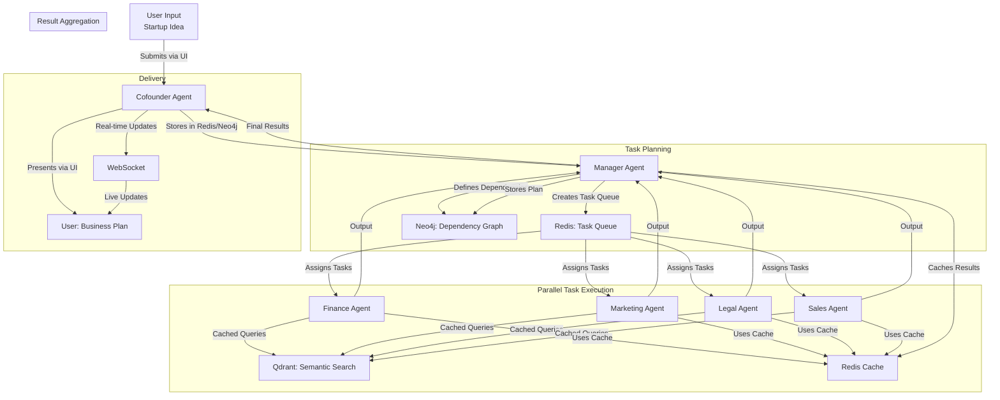
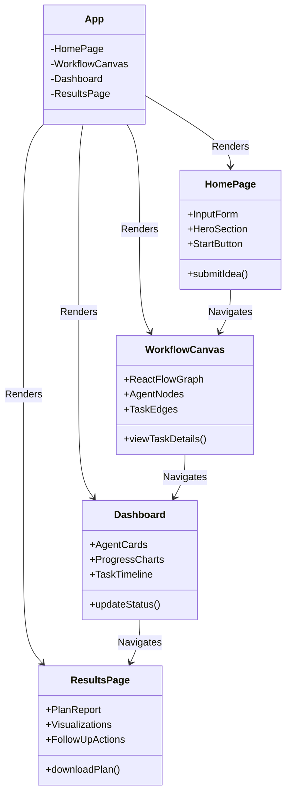

## 🌟 Workflow Description

The **AgentFlow** workflow is designed to transform a user's startup idea into a comprehensive business plan through collaborative AI agents. The workflow is orchestrated by the **Manager Agent**, with the **Cofounder Agent** as the user interface, and other specialized agents working in parallel to produce components of the business plan. The process leverages **Neo4j** for dependency management, **Qdrant** for semantic data retrieval, and **Redis** for real-time state tracking. The workflow is structured to be clear, scalable, and visually representable in the UI for portfolio appeal.

### Workflow Steps
1. **User Input**:
   - The user submits a startup idea (e.g., "sustainable fashion brand") via the UI.
   - The **Cofounder Agent** processes the input, stores it in Redis (session state) and Neo4j (business entity graph).

2. **Task Planning**:
   - The **Manager Agent** analyzes the idea, identifies required tasks (e.g., market analysis, financial modeling), and creates a task queue in Redis.
   - Dependencies between tasks are stored in Neo4j (e.g., Marketing depends on Product's user personas).

3. **Parallel Task Execution**:
   - Specialized agents (Finance, Marketing, Legal, Sales) execute tasks concurrently:
     - **Finance Agent**: Generates financial projections, using cached context for efficiency.
     - **Marketing Agent**: Develops campaign strategies, leveraging Qdrant for trends.
     - **Legal Agent**: Identifies compliance requirements, searching Qdrant for regulations.
     - **Sales Agent**: Build sales strategies based on other agents' outputs.
   - The **Enhanced Orchestrator** monitors progress via Redis queue system, with lazy initialization and caching.

4. **Result Aggregation**:
   - The **Enhanced Orchestrator** collects outputs, stored in Neo4j as a business plan graph.
   - Results are cached in Redis to reduce database queries and improve performance.

5. **User Delivery**:
   - The **Cofounder Agent** presents results via the UI, with data retrieved from cached sources.
   - The system provides real-time updates through WebSocket connections.

### Workflow Visualization (Mermaid)
Below is a **Mermaid flowchart** representing the AgentFlow workflow, showing how agents interact and tasks flow from user input to final output.

**Explanation**:
- **Nodes**: Represent agents, user, or systems (Redis, Neo4j, Qdrant).
- **Edges**: Show data flow (e.g., user input to Cofounder Agent, task assignments to specialized agents).
- **Subgraphs**: Group stages (Input, Task Planning, Execution, Aggregation, Delivery) for clarity.
- **Parallel Execution**: Specialized agents (F, G, H, I, J, K) work concurrently, with dependencies managed by Neo4j.

### Workflow Improvements
- **Clarity**: The Manager Agent centralizes task orchestration, using Redis for fast queuing and Neo4j for dependency tracking, addressing your workflow "stuck" point.
- **Parallelism**: Concurrent task execution reduces latency, with Redis ensuring real-time updates.
- **Visualization**: The workflow is designed to be displayed in the UI (via React Flow), making it intuitive for portfolio demos.
- **Error Handling**: The Manager Agent retries failed tasks or reassigns them, stored in Redis for tracking.

---

## 🌐 UI Description

The UI is designed to be modern, responsive, and portfolio-ready, showcasing the AgentFlow workflow and agent interactions. It uses **React**, **Tailwind CSS**, and **React Flow** (all free) to create an intuitive, interactive experience. The UI emphasizes:
- **Simplicity**: Clean design for ease of use.
- **Interactivity**: Real-time task monitoring and workflow visualization.
- **Portfolio Appeal**: Professional styling and dynamic features to impress viewers.

### UI Components
1. **Home Page**:
   - **Purpose**: Welcome users and collect startup ideas.
   - **Features**: Input form, hero section with project overview, and a "Start Planning" button.
   - **Design**: Minimalist layout with Tailwind CSS, featuring a centered form and branded colors.

2. **Workflow Canvas**:
   - **Purpose**: Visualize and interact with the agent workflow.
   - **Features**: Drag-and-drop interface (React Flow) showing agents as nodes and tasks as edges. Users can click nodes to view task details.
   - **Design**: Full-screen canvas with zoomable graph, styled nodes (agent cards), and animated edges.

3. **Dashboard**:
   - **Purpose**: Monitor agent activities and business plan progress.
   - **Features**: Real-time task status cards, charts (e.g., financial projections), and a timeline of completed tasks.
   - **Design**: Grid layout with Tailwind CSS, featuring agent cards and embedded charts (using Chart.js, free).

4. **Results Page**:
   - **Purpose**: Display the final business plan and allow follow-up actions.
   - **Features**: Downloadable PDF report, interactive visualizations (e.g., market analysis graphs), and follow-up task triggers (e.g., email scheduling).
   - **Design**: Clean layout with sections for each agent's output, styled with Tailwind CSS.

### UI Structure (Mermaid)
Below is a **Mermaid class diagram** representing the UI component hierarchy and their relationships.

**Explanation**:
- **Classes**: Represent UI components (App, HomePage, WorkflowCanvas, Dashboard, ResultsPage).
- **Attributes**: Key elements or subcomponents (e.g., InputForm, AgentNodes).
- **Methods**: Core functionalities (e.g., submitIdea, downloadPlan).
- **Relationships**: Arrows show navigation flow (e.g., HomePage to WorkflowCanvas) and component rendering.

### UI Tech Stack
- **React**: Dynamic, component-based UI.
- **Tailwind CSS**: Utility-first styling for responsiveness.
- **React Flow**: Interactive workflow visualization (free).
- **Chart.js**: Free library for charts in the Dashboard.
- **Axios**: API calls to the FastAPI backend.

### UI Design Principles
- **Responsive**: Adapts to desktop and mobile using Tailwind's responsive utilities.
- **Interactive**: Real-time updates (via WebSockets or polling) for task statuses and workflow changes.
- **Professional**: Clean typography, consistent colors (e.g., blue/white theme), and subtle animations for portfolio appeal.

---

## 💡 Addressing Pain Points

### Workflow
- **Problem**: Unclear how agents collaborate and tasks flow with high resource usage
- **Solution**: The Mermaid flowchart clarifies the process, with LangGraph for efficient agent workflows, lazy initialization to reduce resource usage, and caching to minimize token usage and database queries

### UI
- **Problem**: Original UI lacks modern appeal and has performance issues
- **Solution**: The refactored UI uses Tailwind CSS for styling, React Flow for interactive workflows, and optimized React components (like ReactMarkdown) for better performance

### Performance
- **Problem**: High resource usage at startup and excessive data transactions
- **Solution**: Implemented lazy initialization for all components, caching for context and LLM calls, and optimized queue management to reduce resource usage

---

## 🚀 Implementation Notes

To implement this workflow and UI:
1. **Workflow**:
   - Use **FastAPI** with **LangGraph** for efficient agent workflows and state management
   - Implement lazy initialization for all components to reduce startup time and resource usage
   - Use caching for context and LLM calls to minimize token usage and database queries
   - Integrate **Qdrant** for semantic search using `sentence-transformers/all-MiniLM-L6-v2` (free via Hugging Face)
   - Implement the Manager Agent to monitor Redis and resolve task conflicts

2. **UI**:
   - Set up **React** with `create-react-app` and install `tailwindcss`, `react-flow-renderer`, and `chart.js`
   - Create components as described (HomePage, WorkflowCanvas, etc.) and style with Tailwind
   - Use Axios to fetch task statuses and plan outputs from the FastAPI backend
   - Implement proper component patterns (e.g., using `components` prop for ReactMarkdown)

3. **Free Services**:
   - **Neo4j AuraDB Free**: Set up via [neo4j.com](https://neo4j.com/cloud/aura/) for graph storage
   - **Qdrant Cloud Free**: Configure via [cloud.qdrant.io](https://cloud.qdrant.io/) for vector search
   - **Redis Labs Free**: Use [redislabs.com](https://redislabs.com/) for state management

---

## 📚 Next Steps

- **Memory Optimization**: Implement context pruning to reduce token usage and add compression for large memory objects
- **Agent Communication**: Implement more efficient message passing between agents and reduce redundant context in agent communications
- **LangGraph Improvements**: Optimize state transitions to reduce token usage and implement more efficient node execution patterns
- **Performance Monitoring**: Add detailed performance metrics for each agent and implement token usage tracking
- **Frontend Optimizations**: Implement virtualized lists for large datasets and add progressive loading for agent outputs

## 🔧 Recent Improvements

- **Lazy Initialization**: Implemented lazy initialization for all components to reduce startup time and resource usage
- **Context Caching**: Added TTL-based caching for global context to reduce database queries
- **LLM Call Optimization**: Implemented caching for similar prompts to reduce token usage
- **ReactMarkdown Fix**: Updated component to use proper styling approach
- **Queue Management**: Optimized queue system to initialize only when needed